# Gallery

Here are a few screen shots of the project after about 24 weeks of coding it in my spare time. There is no artwork, 
neither are there some icons right now. I just wanted to make this thing work in the first place. Instead of 
cluttering the UI with icons and features, this approach is quite the opposite - remove as much as possible.
Because the more features we can remove, the earlier this tool becomes usable.

## Main Page and All Projects Page

Main Page with some selected favorites. 

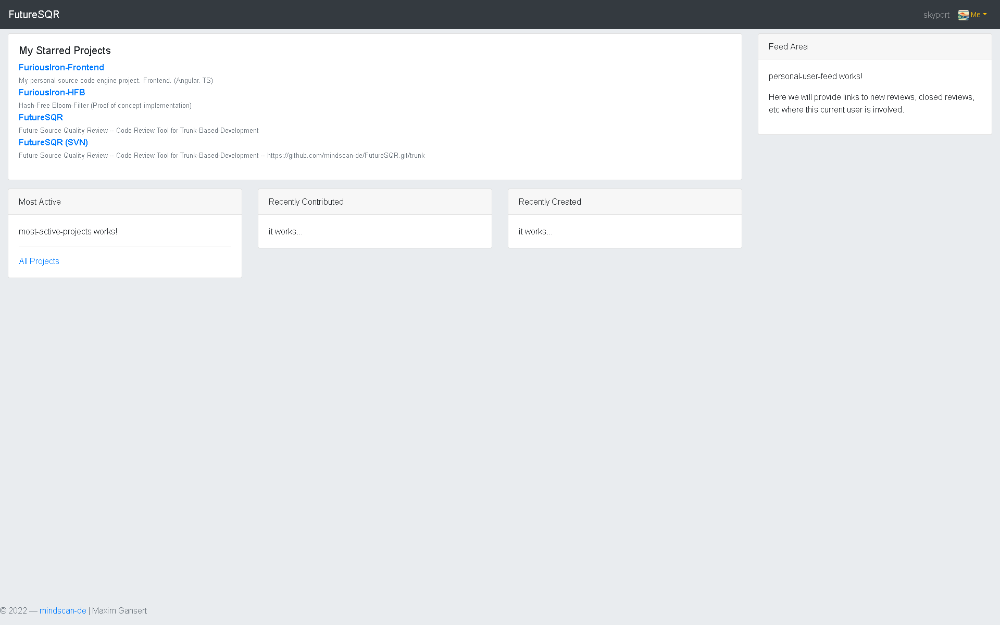

This represents the allprojects page, with some selected favorites.

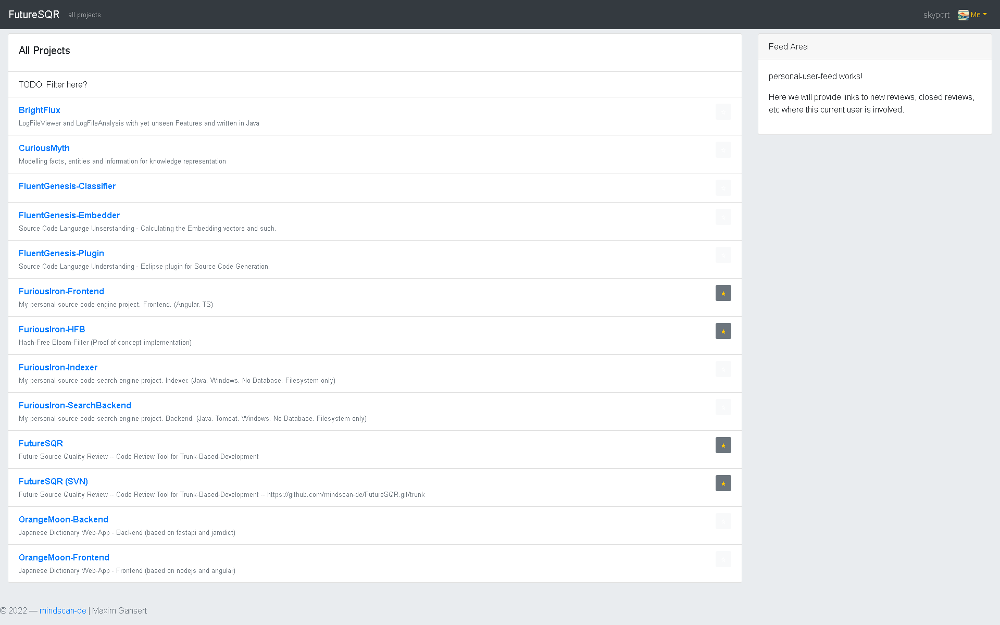

## Project Page

Recent commits page

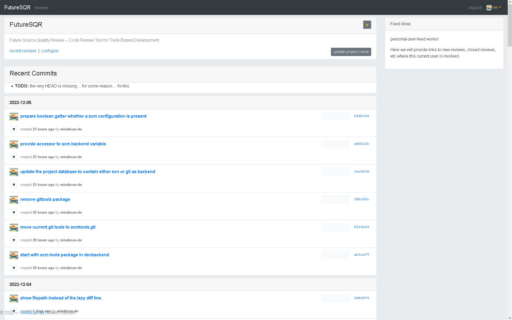

Recent commits page with some open reviews and some expanded file lists with deleted files, modified files and added files.

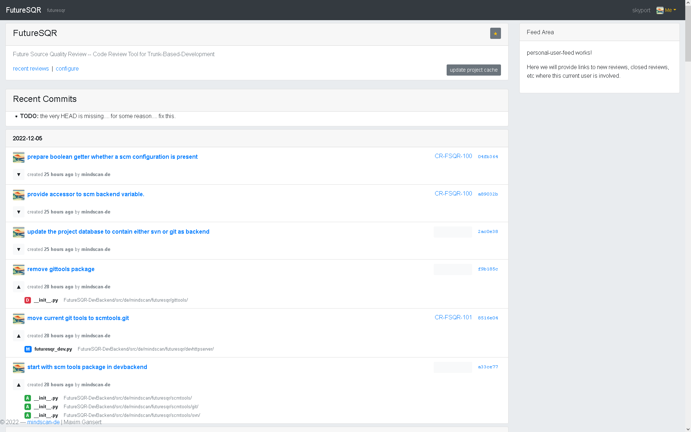

Recent reviews page which shows some unassigned reviews.

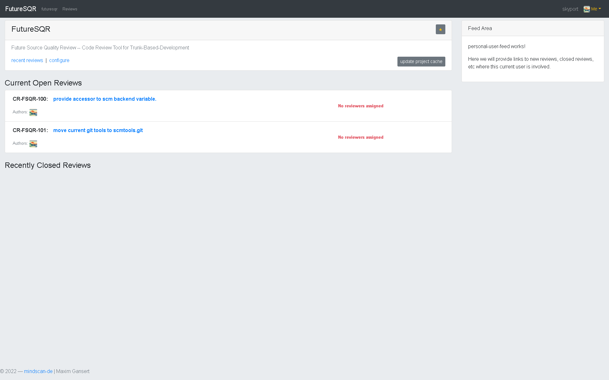

Recent reviews page which shows some assigned and also completed reviews.

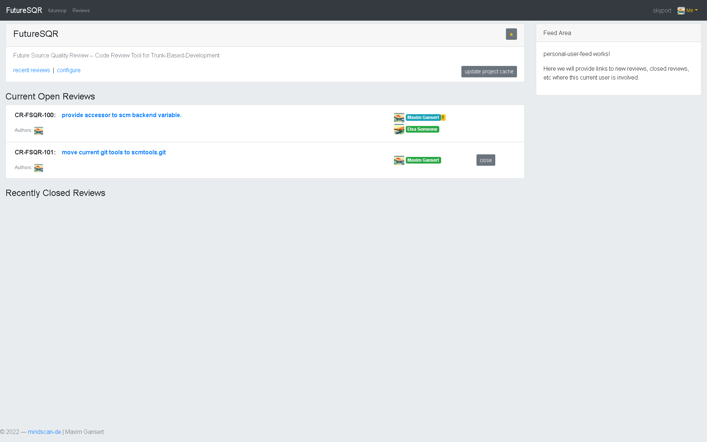

## Review Page

### State - Open review

Open review with no assigned reviewers

Open review with myself assigned as reviewer

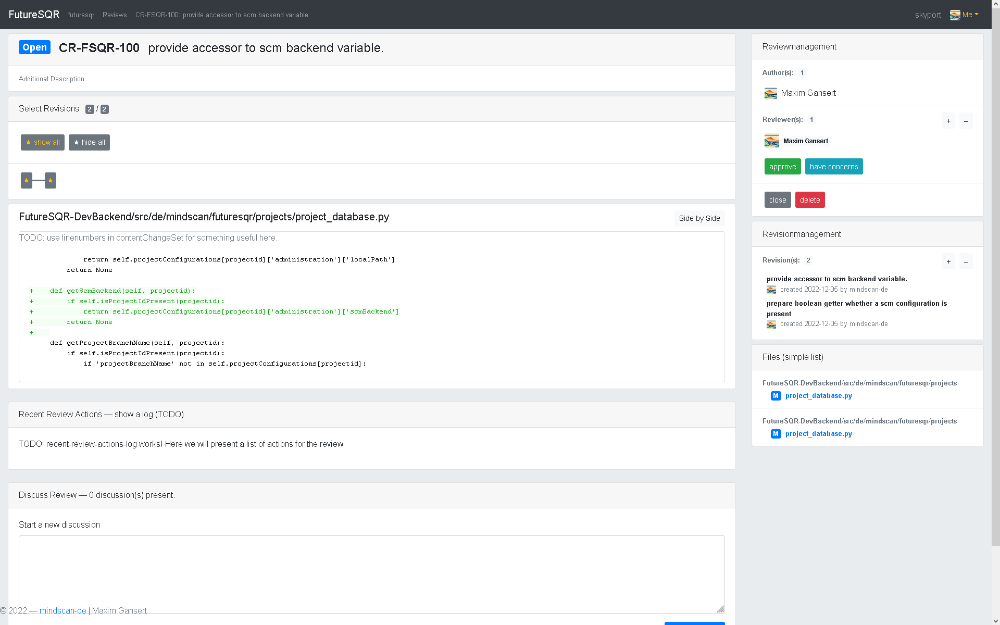

### Add revisions to review

Add revisions to a review

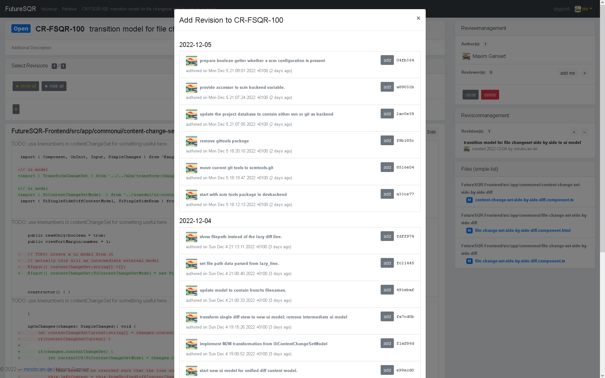

### (very simple) Side by Side comparison

Actually this feature will take some time to be good enough. But for now it looks like this. Side-By-Side view of a change. 

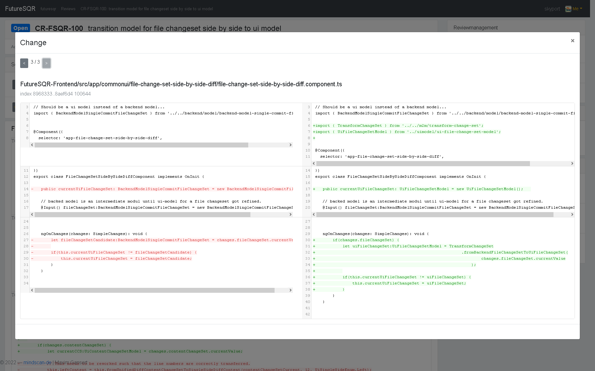

### State - Approved / Concerns

Open review with two assigned reviewers, one has concerns and the other approved this code change.

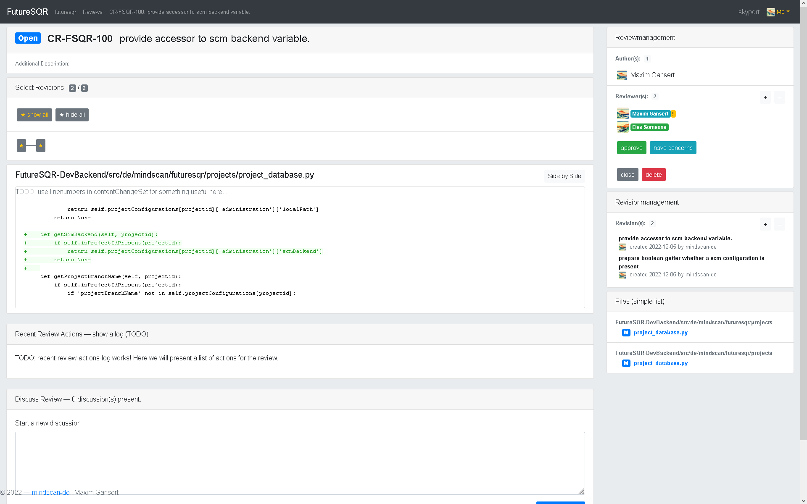

### State - Closed review (TODO: re screenshot it)

A closed review looks like this right now

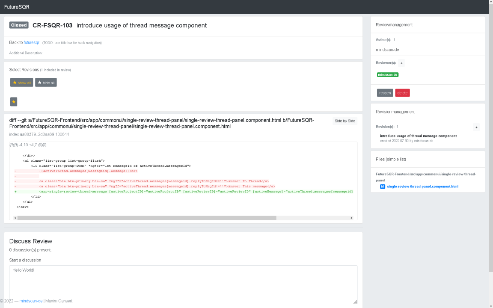

## Revision Page (TODO: re screenshot it)

A revision which is already part of a review

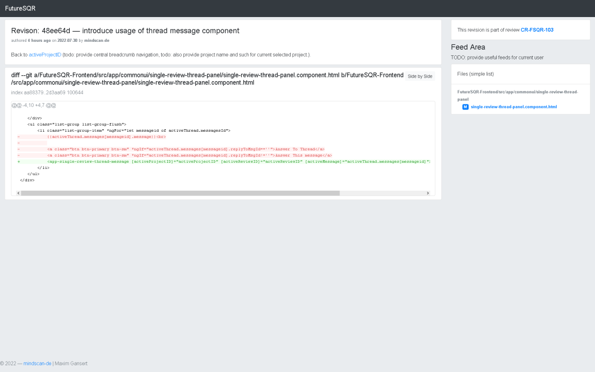

A revision which is not part of a review

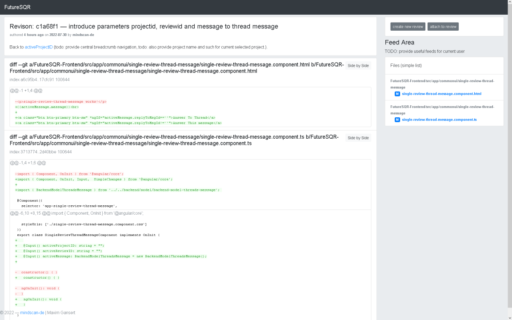