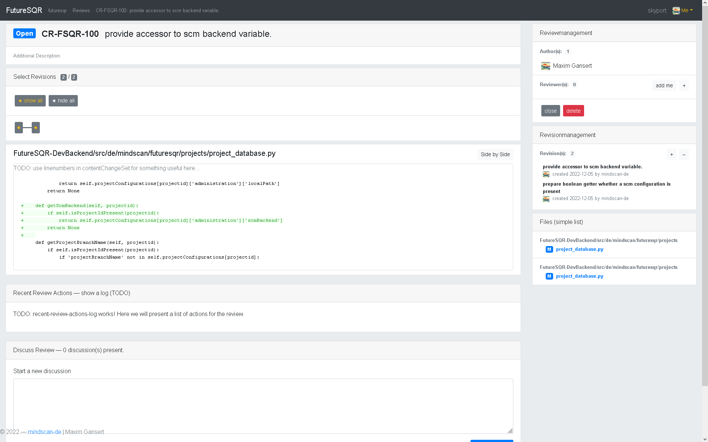

# FutureSQR
Code Review Tool - Future Source Quality Review

For more screen shots please visit the [Screenshot Gallery](Gallery/README.md)

## Why another code review system?
Well, it caught me off guard, that Jetbrains decided to discontinue their product at the beginning of 2022. Upsource was used for a bunch 
of reasons - the main ones were: easy to use, easy to administrate and most importantly easy to integrate into a workflow.

Unlike many people believe, there are some good reasons to not only look at Git and their  feature-branch and pull-request system. 
Despite Git being a quite useful SCM system, people tend to forget, that there are other SCM systems out there for a reason. We tend to
forget, that Git was developed for a reason, namely to develop a monolithic system, in a distributed manner, where you don't trust the contributors,
while at the same time, to not discourage them to provide useful improvements to the code base. This is one undeniable strength of Git.
It solved a certain type and style of collaboration in an open source environment, while at the same time avoiding "contributions" of malicious contributors 
or actors. 

Another still important SCM system is SVN and there are good reasons to prefer it over other SCM systems. Like in cases where you combine
SCM with configuration management and want the configuration management also being version managed as well.

Therefore we can conclude there are good reasons to support Git as well as SVN for a code review tool. 

Another important thing is that there are different types of collaborations possible. In case of a corporate environment, there is an intrinsic
alignment between members of a team, which is essentially done by the working contract. Therefore a SCM system which is enforcing some sort of 
synchronization process (which is useful in an open source environment) might be considered inefficient in a corporate environment. The
current most efficient type of collaboration in development is trunk-based-development. You can find enough sources supporting this claim,
don't let me spoon feed you. In a corporate environment trunk-based-development is considered SOTA (state of the art). So now the big 
question, if trunk based development is more efficient compared to feature-branches, do we need to use a SCM supporting feature branches, or is this just
a nice-to-have feature (remember in a corporate setting)?

Most of the newer code review tools only have the Git / Pull-Requests and the feature-branch development in mind. But this feature-branch approach
requires extra synchronization and creates extra bottlenecks and creates extra waiting times until a delivery of a feature or a bug fix. The
delivery of a feature or a bugfix becomes somehow unpredictable. 

There is a need for a code-review system which can still work post commit, which adds no extra synchronization between people and where
people are not forced to wait for each other. An improvement of the source code as a result of a code review can still be applied later on trunk
and can be delivered to the customer. There is no need to punish people by rejecting their code, in an environment where they are paid for
creating this code in the first place. When there is a need to improve the code, it can still be done. Each time the code is not integrated to trunk, the 
non integrated code looses value. The longer code waits for its integration on trunk, the more likely it is that errors post integration are found
late - even though it is reviewed.

Therefore a demand for a code-review tool what is able to handle at least SVN and GIT and what is supporting trunk-based development
at its core still exists. This project will hopefully provide a solution which is as easy to use, as the tool which I still regard highly despite being
discontinued. It still is and was a good, simple and efficient tool - Thank you for this.

Anyhow, as the world progresses, there is still demand for a good, simple and efficient code review tool. Let's make it!

## Current State of this Project

Attention: The implementation of a Proof of Concept has been started.

Also there is a python based developer backend - but it has all issues like hard coded values in it and has no error handling and such.
This particular python developer backend doesn't persist any of the data, and only provides in-memory-storage until service restart. 
The current state after about 26 weeks of working on it in my spare time, can be seen in the [Screenshot Gallery](Gallery/README.md)

As for now speaking I currently in the process to develop some java code base to access git and implement a domain model and its logic 
for the code reviews. Such that a future java based web server can then use the core domain model to provide the content for the UI.

## Principles of Development

* Useful from Day One
* My three other principles (won't tell them here...)
* Bottom-Up Development

## Split in actually two different Applications+Services

FutureSQR
* Frontend Monolith - Code-Review-Application
* Backend Monolith - Code-Review-Application

Dev-Backends
* One or multiple Backends
  * At least one Dev-Backend for the Code-Review
  * At least one Dev-Backend for the Configuration Application
    * configue the code-review application
	* configure the users
	* configure the roles, groups, etc, 
	* configure authn, authz
	* provide access control for Code-Review Application

Kuukou (Skyport) - Application
* Frontend Monolith - Configuration App (User Management + Access Control + Application Configuration)
* Backend Monolith - Configuration App (User Management + Access Control + Application Configuration)

Idea is, that "Kuukou" can be reused for other applications as well, because this is a generic problem this only needs to be solved once.

## Next Points of Action
* User management
* Rights Management
* Access Management
* Transition to a non developer Backend
* Build a SOTA Diff-Algorithm and presentation, which allows to combine multiple singe revisions into one human readable diff - this is the hard part for now
* Attach to review
* Combine File list if they share the same path / sort by path (m2m transformer)
----
* UserFeed 
  * requires multi user support
  * requires recent changes log system (by user or by project, by message type)
  * requires template system for recent change log messages
  
* provide a list of reviewers (on the + button)
  * requires a user database
  * requires some logic to select a user (suggestion is hard)
  * requires a search/select for a user - without providing the user all user entries
  
* render markdown for the discussions

* attach discussions to files and track the files and the discussions related to the files.

## Scrapped plans - Top-Down

* Description of what we want to reach (some green/white paper like description) ((**The current phase**)) 
  * [You may want to have a look here first](FutureSQR-Architecture/documents/README.md)
  * It describes some of the objectives and some basic requirements
* Tryout Section
  * [Some concepts which I'm not familiar with, but deem somehow important](Tryouts/README.md)
* Work on requirements and user stories
  * Extract requirements and user stories from the description
* Work towards a first System and Software architecture
  * Identify architecturally relevant requirements
  * Identify quality attributes for the system
  * Identify a system architecture
  * Identify a software architecture
  * document the system and its software architecture
  * document the cross section concepts / cross cutting-concern and their particular architecture and solutions
* Iterate between architecture and requirements
* Specify the mode of development and split these concerns
  * e.g. separation of frontend and backend development, (e.g. by specifying the exchanged data)
  * e.g. how to see something from day #1 of development
  * e.g. write some scripts / tools for this mode of development
  * e.g. plan a mocked development back-end (maybe python with fast-api)
